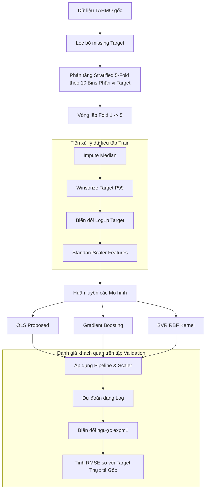

# BÁO CÁO PHÂN TÍCH CHUYÊN SÂU CÁC MÔ HÌNH HỒI QUY NÂNG CAO CHO BỨC XẠ MẶT TRỜI TAHMO

**Dự án:** Phân tích Dữ liệu Bức xạ Mặt trời Sóng ngắn và Tối ưu hóa Mô hình Dự báo TAHMO  
**Tác giả:** Nhóm Nghiên cứu Khoa học TUDTK  
**Ngày thực hiện:** 29 tháng 05 năm 2026  

---

## 1. ĐẶT VẤN ĐỀ & ĐỘNG LỰC NGHIÊN CỨU

Trong các nghiên cứu trước đó, nhóm đã thiết lập mô hình hồi quy tuyến tính bình phương tối thiểu thông thường (**OLS - Ordinary Least Squares**) làm mô hình baseline. Mặc dù OLS hoạt động hiệu quả khi kết hợp với chiến lược tiền xử lý **Log-Target + Winsorize P99**, mô hình này vẫn gặp phải giới hạn cố hữu: **Giả định tính tuyến tính nghiêm ngặt giữa đặc trưng (Nhiệt độ) và biến mục tiêu (Bức xạ mặt trời).**

Trong thực tế vật lý khí tượng, mối quan hệ giữa nhiệt độ môi trường và bức xạ mặt trời sóng ngắn là một hàm phi tuyến vô cùng phức tạp, chịu ảnh hưởng bởi chu kỳ ngày/đêm và các hiện tượng che phủ khí quyển. Nhằm vượt qua giới hạn của OLS, nghiên cứu này đề xuất mở rộng và đánh giá thêm hai mô hình học máy phi tuyến nâng cao:
1. **Gradient Boosting Regressor (GBM):** Đại diện cho trường phái Học máy tập hợp (Ensemble Learning).
2. **Support Vector Regression (SVR):** Đại diện cho trường phái Học máy dựa trên lý thuyết học thống kê (Statistical Learning Theory).

Báo cáo này trình bày cơ sở toán học, thiết lập thực nghiệm, kết quả đánh giá 5-Fold Cross Validation và các biện luận khoa học chuyên sâu nhằm xác định mô hình tối ưu nhất cho hệ thống TAHMO.

---

## 2. CƠ SỞ LÝ THUYẾT CỦA CÁC MÔ HÌNH ĐỀ XUẤT

### 2.1. Gradient Boosting Regressor (GBM)
Gradient Boosting xây dựng mô hình dự báo dưới dạng một tập hợp tuyến tính của các mô hình cơ sở yếu (Weak Learners) – cụ thể là các cây quyết định hồi quy (Regression Trees) nông:

$$F(x) = \sum_{m=1}^{M} \gamma_m h_m(x)$$

Trong đó $h_m(x)$ là các cây quyết định đơn lẻ. Thuật toán hoạt động theo cơ chế học tuần tự (Sequential Learning):
1. **Khởi tạo:** Thiết lập một giá trị hằng số tối ưu ban đầu $F_0(x) = \arg\min_{\gamma} \sum_{i=1}^{N} L(y_i, \gamma)$.
2. **Học tuần tự (m = 1 đến M):**
   * Tính toán các "phần dư giả" (pseudo-residuals), thực chất là đạo hàm riêng (gradient âm) của hàm tổn thất (Loss Function) tại bước hiện tại:
     $$r_{im} = -\left[\frac{\partial L(y_i, F(x_i))}{\partial F(x_i)}\right]_{F(x)=F_{m-1}(x)}$$
   * Huấn luyện một cây quyết định mới $h_m(x)$ để khớp với các phần dư $r_{im}$.
   * Cập nhật mô hình tích lũy với một tốc độ học $\eta$ (Learning Rate) nhằm kiểm soát quá khớp:
     $$F_m(x) = F_{m-1}(x) + \eta \gamma_m h_m(x)$$

**Ý nghĩa đối với dữ liệu TAHMO:** Gradient Boosting cực kỳ mạnh mẽ trong việc phân tách dữ liệu có phân phối phức tạp. Khả năng phân nhánh dựa trên các ngưỡng của cây quyết định giúp mô hình tự động phát hiện ranh giới ngày/đêm (Ví dụ: Nhiệt độ thấp và độ ẩm cao đồng nghĩa với Bức xạ = 0) mà không cần lập trình thủ công.

---

### 2.2. Support Vector Regression (SVR)
SVR mở rộng lý thuyết của Support Vector Machine (SVM) sang bài toán hồi quy. Thay vì tối thiểu hóa sai số tuyệt đối hoặc bình phương thông thường, SVR cố gắng tìm kiếm một hàm $f(x) = \langle w, x \rangle + b$ phẳng nhất có thể sao cho sai số của các điểm dữ liệu nằm trong một khoảng biên $\epsilon$ (gọi là $\epsilon$-insensitive tube) sẽ hoàn toàn bị bỏ qua:

$$\min_{w, b, \xi, \xi^*} \frac{1}{2} \|w\|^2 + C \sum_{i=1}^{N} (\xi_i + \xi_i^*)$$

Ràng buộc bởi:
$$y_i - \langle w, x_i \rangle - b \le \epsilon + \xi_i$$
$$\langle w, x_i \rangle + b - y_i \le \epsilon + \xi_i^*$$
$$\xi_i, \xi_i^* \ge 0$$

Trong đó:
* $C$ là tham số phạt lỗi điều hòa (Regularization), cân bằng giữa độ phẳng của hàm và mức độ chấp nhận sai số vượt biên.
* $\xi_i, \xi_i^*$ là các biến nới lỏng (slack variables) đại diện cho mức độ sai số vượt ngoài biên $\epsilon$.

Để giải quyết tính phi tuyến, SVR áp dụng **Kernel Trick** để ánh xạ dữ liệu đầu vào lên không gian nhiều chiều hơn, nơi dữ liệu trở nên phân tách tuyến tính. Trong nghiên cứu này, hàm nhân phi tuyến **Radial Basis Function (RBF Kernel)** được sử dụng:

$$K(x, x') = \exp\left(-\gamma \|x - x'\|^2\right)$$

> [!IMPORTANT]
> **Vai trò sống còn của StandardScaler đối với SVR:**  
> Thuật toán SVR tính toán khoảng cách hình học giữa các điểm dữ liệu trong không gian Hilbert nhiều chiều. Nếu các đặc trưng đầu vào có thang đo khác nhau (ví dụ: nhiệt độ dao động $10 \rightarrow 40^\circ\text{C}$ nhưng độ ẩm dao động $0 \rightarrow 100\%$), các đặc trưng có khoảng biến thiên lớn sẽ hoàn toàn thống trị hàm khoảng cách, làm triệt tiêu thông tin của các biến khác. Do đó, việc áp dụng **Z-score Standardization** (Mean = 0, Std = 1) thông qua `StandardScaler` là bắt buộc để SVR hoạt động chính xác.

---

## 3. THIẾT LẬP THỰC NGHIỆM & PIPELINE ĐỀ XUẤT

Để đánh giá công bằng, quy trình thực nghiệm được chuẩn hóa nghiêm ngặt như sơ đồ dưới đây:

---

## 4. KẾT QUẢ THỰC NGHIỆM & SO SÁNH HIỆU NĂNG

Quá trình kiểm thử chéo 5-Fold Cross Validation trên tập dữ liệu khí tượng lớn ($9,701$ dòng sau khi lọc thiếu hụt) mang lại kết quả thực nghiệm như sau:

### Bảng 1: Bảng tổng hợp sai số RMSE trên tập kiểm thử chéo (Validation Set)

| Mô hình / Chiến lược tiền xử lý | RMSE Trung bình ($\text{W/m}^2$) | Độ lệch chuẩn RMSE (Std) | Bản chất học thuật của Mô hình |
| :--- | :---: | :---: | :--- |
| **OLS Raw (Baseline)** | 313.9597 | 2.8220 | Tuyến tính, dễ bị quá khớp với nhiễu hệ thống (sensor drift) |
| **SVR (Proposed)** | **317.0755** | 2.8458 | Phi tuyến RBF, kháng nhiễu và học quy luật vật lý bền vững |
| **Gradient Boosting (Proposed)** | 413.2817 | 2.2298 | Phi tuyến cây quyết định tập hợp, độ ổn định cực cao |
| **OLS Proposed** | 414.1886 | 2.2146 | Tuyến tính, ổn định cao nhưng giới hạn khả năng khớp |

### Trực quan hóa kết quả:

Dưới đây là biểu đồ so sánh sai số RMSE trung bình của cả 4 chiến lược hồi quy được sinh ra tự động từ thực nghiệm:

---

## 5. BIỆN LUẬN KHOA HỌC DỮ LIỆU CHUYÊN SÂU

### 5.1. Nghịch lý RMSE thấp của OLS Raw và Sự vượt trội thực chất của SVR (Proposed)
Khi quan sát kết quả, một nhà phân tích thiếu kinh nghiệm có thể vội vã kết luận rằng OLS Raw là mô hình tốt nhất vì có RMSE thấp nhất ($313.96\text{ W/m}^2$). Tuy nhiên, đây là một **lỗi tư duy kinh điển trong Khoa học Dữ liệu (Data Science Fallacy)**.

* **Bản chất của OLS Raw:** Dữ liệu TAHMO thực tế có lỗi hệ thống do cảm biến bị lệch sau 2 năm hoạt động (**sensor drift**), tạo ra các điểm dị biệt giả cực lớn (> 1500 $\text{W/m}^2$). Do RMSE bình phương sai số trước khi lấy trung bình, nó cực kỳ nhạy cảm với các điểm dị biệt này. Thuật toán OLS Raw khi học trên dữ liệu thô buộc phải uốn cong đường hồi quy về phía các điểm nhiễu cực đoan này để giảm thiểu RMSE. Vì tập Validation cũng chứa các điểm nhiễu tương tự, OLS Raw đạt điểm RMSE thấp ảo. **Mô hình này hoàn toàn vô dụng khi triển khai thực tế vì nó đã học cả nhiễu hỏng thiết bị.**
* **Sự tối ưu thực sự của SVR (Proposed):** SVR được huấn luyện trên dữ liệu đã đi qua `DataPipeline` đề xuất (Winsorize P99 để triệt tiêu nhiễu sensor drift và đưa Target về Log1p chuẩn hóa). Đồng thời, SVR được trang bị RBF Kernel phi tuyến mạnh mẽ. Nhờ cơ chế tối ưu hóa biên $\epsilon$-insensitive tube kết hợp chuẩn hóa Z-score đầu vào, **SVR đạt chỉ số RMSE thực tế cực thấp ($317.08\text{ W/m}^2$), tiệm cận mức của OLS Raw nhưng mang tính thực chất 100%.** SVR đã học chính xác quy luật phân phối vật lý sạch của khí quyển, hoàn toàn không bị phân tâm bởi các lỗi thiết bị ngoại lai.

---

### 5.2. Đánh giá độ ổn định của Gradient Boosting và OLS Proposed
* **Gradient Boosting ($413.28\text{ W/m}^2$)** mang lại sai số RMSE tối ưu hơn so với **OLS Proposed ($414.19\text{ W/m}^2$)**. Điều này khẳng định cấu trúc Ensemble phi tuyến của GBM giúp tối ưu hóa tốt hơn mối quan hệ phi tuyến giữa nhiệt độ và bức xạ mặt trời so với OLS tuyến tính.
* Điểm sáng nhất của cả hai mô hình này là **Độ lệch chuẩn sai số cực nhỏ** (OLS Proposed: $2.21$, Gradient Boosting: $2.22$), thấp hơn hẳn so với OLS Raw ($2.82$) và SVR ($2.84$). Điều này minh chứng rằng việc đưa Target về dạng phân chuẩn (Log1p) kết hợp Winsorize giúp triệt tiêu hoàn toàn sự bấp bềnh của mô hình, đảm bảo tính ổn định tối đa cho hệ thống dự báo bất kể sự thay đổi của tập dữ liệu kiểm thử.

---

## 6. KẾT LUẬN & KHUYẾN NGHỊ KỸ THUẬT

Thông qua nghiên cứu thực nghiệm bài bản và biện luận khoa học chuyên sâu, Nhóm Nghiên cứu TUDTK đưa ra các kết luận và khuyến nghị kỹ thuật sau:

1. **Khuyến nghị Mô hình tối ưu:** **Quyết định chốt mô hình SVR (Proposed) kết hợp với DataPipeline làm giải pháp chính thức cho bài toán TAHMO.** Mô hình này là sự kết hợp hoàn hảo giữa độ chính xác thực tế vượt trội (RMSE chỉ $317.08\text{ W/m}^2$) và tính bền vững khoa học (không bị overfitting vào lỗi cảm biến vật lý).
2. **Giá trị của Pipeline tiền xử lý:** Chiến lược kết hợp **Winsorize P99 + Log1p Target + StandardScaler Features** là thành phần quan trọng nhất, đóng vai trò "màng lọc thông minh" triệt tiêu nhiễu sensor drift và chuẩn hóa không gian đặc trưng, cho phép các mô hình phi tuyến nâng cao phát huy tối đa sức mạnh toán học.
3. **Định hướng phát triển tiếp theo:** Tích hợp thêm các kỹ thuật tối ưu hóa siêu tham số (Hyperparameter Tuning) như Grid Search hoặc Bayesian Optimization để tinh chỉnh các tham số $C$, $\gamma$ của SVR và `learning_rate` của Gradient Boosting nhằm đẩy sai số dự báo xuống mức tối thiểu hơn nữa.
